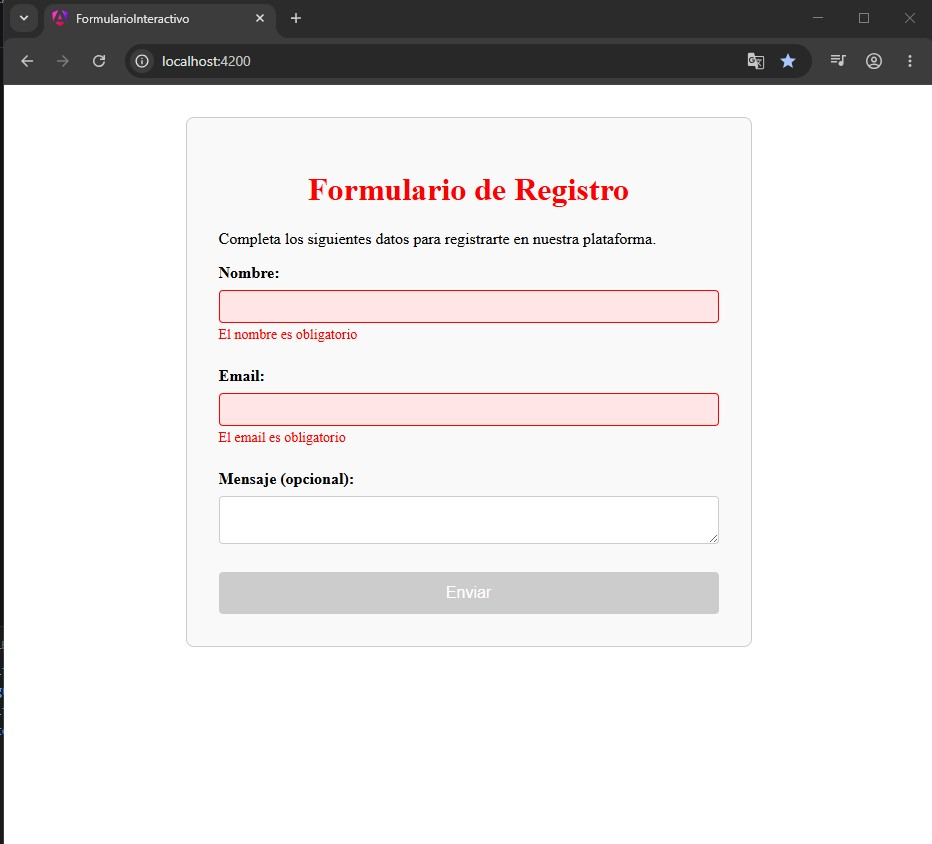
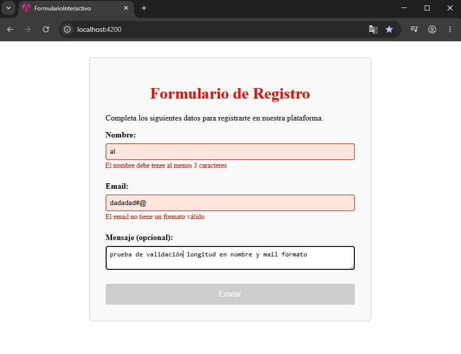
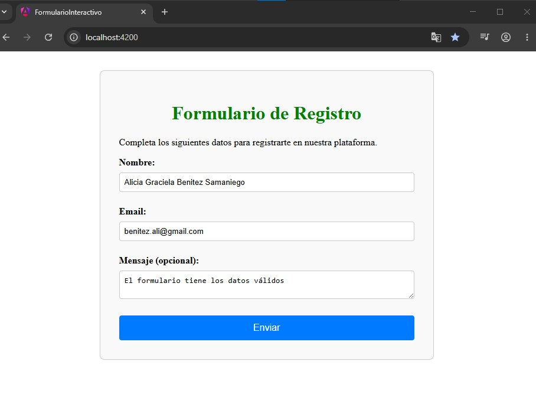
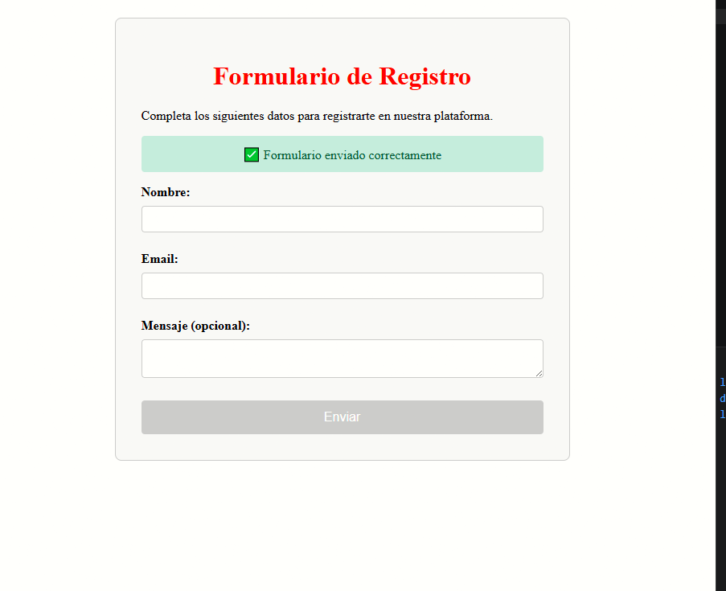
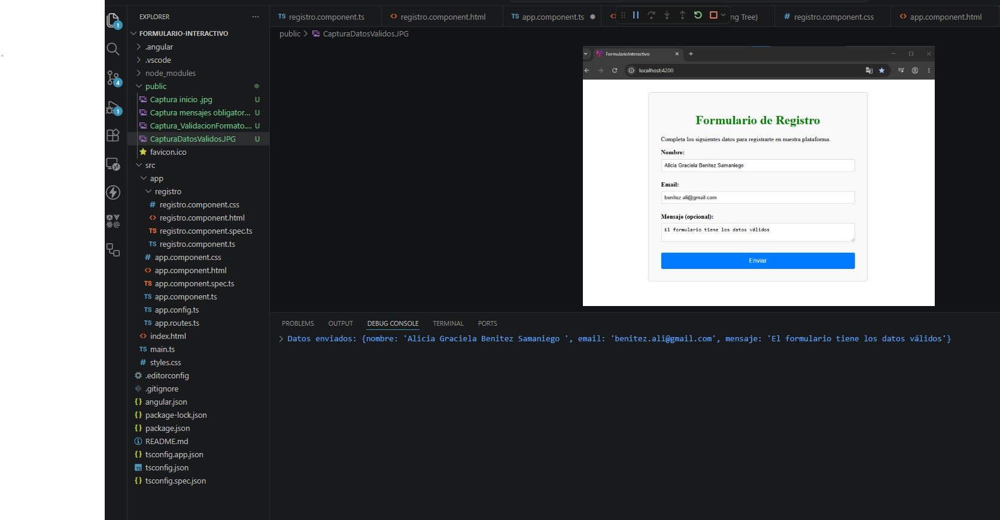
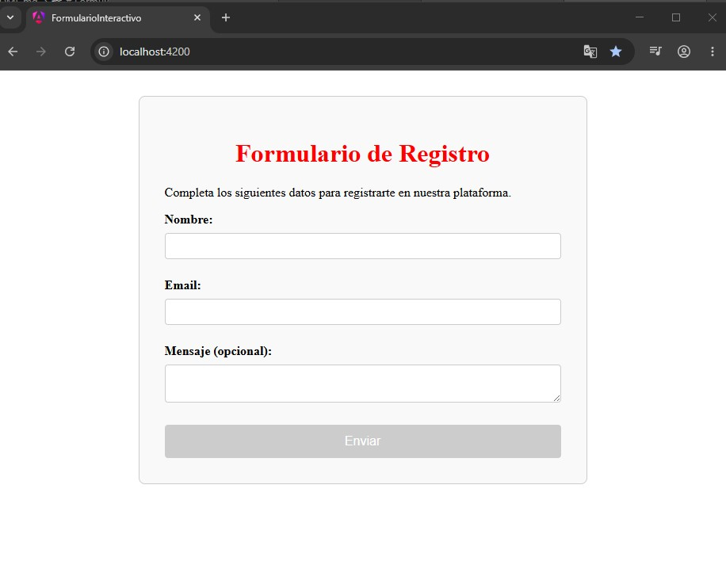

# Formulario Interactivo - Angular 19.2

## Descripción del proyecto

Este proyecto consiste en el desarrollo de un formulario interactivo utilizando Angular 19.2 y formulario reactivo.  
Se implementaron validaciones dinámicas y directivas propias de Angular.

El formulario incluye los siguientes campos:

- Nombre (obligatorio y mínimo 3 caracteres)
- Email (obligatorio y con formato válido)
- Mensaje (opcional)

Además, se aplicaron las siguientes funcionalidades:

- Uso de `*ngIf` para mostrar mensajes de envío exitoso.
- Uso de `*ngFor` para listar errores de validación.
- Uso de `[ngClass]` para resaltar campos inválidos.
- Uso de `[ngStyle]` para modificar estilos dinámicamente.
- Botón de envío deshabilitado mientras el formulario sea inválido.
- Reinicio automático del formulario después del envío.

---

## Tecnologías utilizadas

- Angular 19.2
- TypeScript
- HTML5
- CSS3
- Reactive Forms

---

## Instrucciones de instalación y ejecución

### Clonar el repositorio

```bash
git clone https://github.com/usuario/nombre-repositorio.git
```

### 2. Ingresar al proyecto

```bash
cd nombre-repositorio
```

### 3. Instalar dependencias

```bash
npm install
```

### 4. Ejecutar el proyecto

```bash
ng serve
```

Abrir en el navegador:

```bash
http://localhost:4200/
```

---

## Ejemplo de ejecución en consola

```bash
>Formulario enviado correctamente:
{
  nombre: 'Juan Garcia',
  email: 'juang@email.com',
  mensaje: 'Hola, este es un mensaje de prueba'
}
```

## Capturas de pantalla

### Formulario con errores de validación

Capturas mostrando:

- Nombre vacío o con menos de 3 caracteres.
- Email inválido.
- Mensajes de error visibles.
- Botón deshabilitado.





---

### Formulario válido

Se muestra captura:

- Todos los datos completos correctamente.
- Estilos aplicados con formulario válido.
- Botón habilitado.



---

### Formulario enviado correctamente

- Mensaje “Formulario enviado”. A los 5 segundos desaparece mensaje.
- Formulario reseteado.



---

## Consola con los datos enviados.



## Formulario reseteado.



---

## Créditos de Autor

- Nombre del estudiante: Alicia Benitez
- Curso: Angular Básico
- Unidad: 2 Directivas y Formularios

---

## Bibliografía y fuentes

### Documentación oficial

- Angular Reactive Forms  
  https://angular.dev/guide/forms/reactive-forms

- Angular Directives  
  https://angular.dev/guide/directives

- Angular Forms  
  https://angular.dev/guide/forms

### Bibliografía

- Freeman, A. _Pro Angular 9_. 6ª edición. Apress, 2020.
